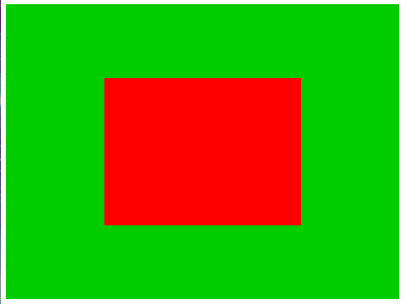

# Game Engine
Progress of game engine build while reading "Build Your Own 2D Game Engine and
create Great Web Games".

## Differences
Rather than follow the book to the leter, I'm making few different design
choices as I go along:
- using parcel to bundle and serve the game
- using more modern syntax when applicable (eg, `fetch` and `async/await`
    insteada of `XMLHttpRequest`)

In the future, I'd like to use a more functional design, though avenues for
doing so are still being explored

## Current Progress
The following screenshot shows what the engine can currently do:

